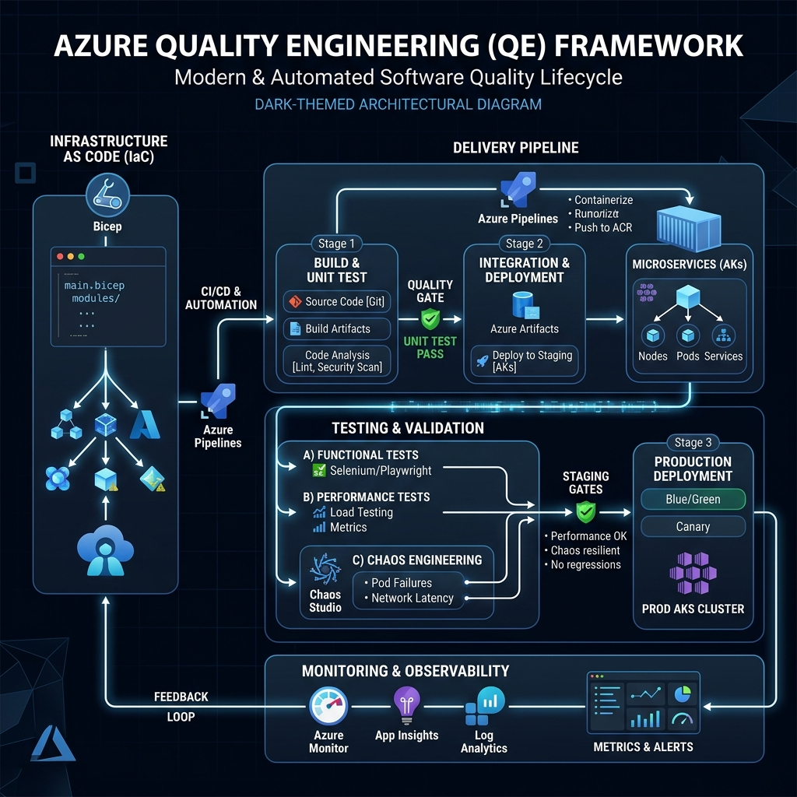

# Azure QE Architecture - Quality Engineering for Microsoft Azure

**Build quality-first cloud modernization on Microsoft Azure.**

This repository contains **battle-tested frameworks, reference implementations, and tools** for designing and executing QE architecture across Azure modernization programs—from strategy to automation to metrics.

Used by teams across healthcare, finance, and retail to reduce defect escape rates by 80%+ and improve release predictability on Azure.

## Why this matters

Most Azure modernization programs treat quality as an afterthought:
- ❌ Quality gates added after architecture locks
- ❌ Performance validated in production
- ❌ No measurable SLOs until too late
- ❌ Manual quality work doesn't scale

**This changes that.** We provide:
- ✅ Quality strategy frameworks (by migration type)
- ✅ Automated quality gates (Azure DevOps / GitHub Actions → production)
- ✅ NFR engineering (SLO/SLI, performance, chaos)
- ✅ Measurable outcomes (defect escape, DORA metrics)
- ✅ Ready-to-use templates and Azure-native implementations

## What's inside

### 📚 **Frameworks & Playbooks** (Start here)
- **[Quality Strategy for Modernization](docs/01-quality-strategy-for-azure-modernization.md)** — How to approach quality differently by migration type (rehost/replatform/refactor)
- **[Performance Engineering on Azure](docs/05-performance-engineering-azure.md)** — Shifting left with Bicep/Terraform + Azure Pipelines
- **[Chaos Engineering Playbook](docs/06-chaos-engineering-playbook-azure.md)** — Azure Chaos Studio + resilience experiments

### 🔧 **Reference Implementations** (Copy & customize)
- **[Terraform Azure Baseline](reference-implementations/terraform-azure-baseline/)** — Secure landing zone modules for Azure
- **[Azure Chaos Studio Experiments](reference-implementations/azure-chaos-studio/)** — VM shutdown, AKS pod failure, and network stress templates
- **[k6 Performance Tests](reference-implementations/k6-azure/)** — Load test harness integrated with Azure Load Testing
- **[Azure Monitor SLOs](reference-implementations/slo-monitoring-azure/)** — Terraform modules for SLO dashboards and Log Analytics alerts

### 🛠️ **Tools** (Execute at scale)
- **[Azure Cost + Quality Optimizer](tools/azure-cost-quality-optimizer/)** — Script to correlate performance vs Azure consumption
- **[Defect Escape Analyzer](tools/defect-escape-analyzer-azure/)** — Correlate Azure-specific incidents to quality gate gaps

### 📖 **Service-Specific Guides**
- [AKS Testing Guide](guides/aks-testing-guide.md) — Multi-cluster, service mesh, and Azure CNI quality
- [Azure Functions Quality Framework](guides/azure-functions-quality.md) — Cold starts, scaling, and event-driven testing
- [Azure SQL Resilience Guide](guides/azure-sql-resilience.md) — Failover groups and performance insights
- [App Service Quality Patterns](guides/app-service-quality.md) — Deployment slots and auto-healing

### 📋 **Templates** (Adapt to your program)
- [Test Strategy Template (Azure Flavor)](templates/test-strategy-template-azure.md)
- [Prod Readiness Review Checklist](templates/prod-readiness-review.md)
- [NFR Spec Template](templates/nfr-spec-template.md)

## Tech stack

- **IaC:** Terraform, Bicep, ARM Templates
- **CI/CD:** Azure DevOps, GitHub Actions
- **Policy:** Azure Policy, OPA
- **Testing:** k6, Playwright, Azure Chaos Studio
- **Observability:** Azure Monitor, Application Insights, Log Analytics
- **Languages:** Python, C#, HCL, Bicep

## 🔗 Related Repositories
- [gcp-qe-architecture](https://github.com/anandkrshnn-ai/gcp-qe-architecture) — GCP counterpart
- [aws-qe-architecture](https://github.com/anandkrshnn-ai/aws-qe-architecture) — AWS counterpart

## Contributing

We welcome contributions! 

See **[CONTRIBUTING.md](CONTRIBUTING.md)** for details.

## License

MIT License — Use freely, attribute appreciated.

## Questions?

- 💬 Open an issue
- 🔗 LinkedIn: [Anandkrshnn](https://www.linkedin.com/in/anandkrshnn/)

---

**Built for engineering leaders who believe quality should be measurable, automated, and integrated into the entire Azure delivery pipeline.**
